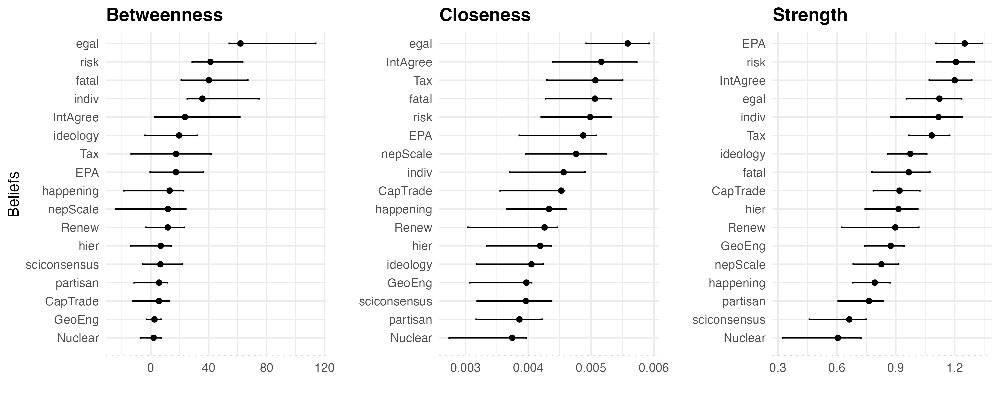
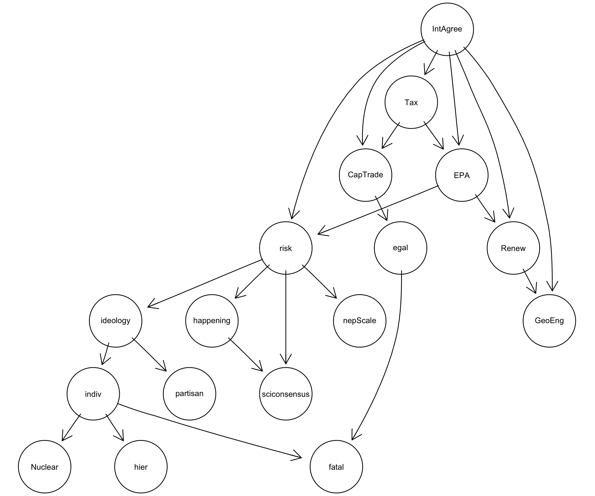

```{r setup}
#| include: false
#| message: false
knitr::opts_knit$set(root.dir = normalizePath(".."))
```

```{r load data and packages}
#| echo: false
#| include: false
#| warning: false

## packages 
library("tidyverse")
library("bootnet")
library("qgraph")
library("ggplot2")
library("egg")
library("car")
library("ppcor")
library("modelsummary")
library("networktools")
library("NetworkComparisonTest")

## load data 
beliefData <- read.csv("data/beliefDataRep.csv")

## code for cronbach alpha using psy package
hierA <- psy::cronbach(data.frame(beliefData$hier1,beliefData$hier2,beliefData$hier3))
egalA <- psy::cronbach(data.frame(beliefData$egal1,beliefData$egal2,beliefData$egal3))
indivA <- psy::cronbach(data.frame(beliefData$indiv1,beliefData$indiv2,beliefData$indiv3))
fatalA <- psy::cronbach(data.frame(beliefData$fatal1,beliefData$fatal2,beliefData$fatal3))

## NEP scale 
beliefData$nepScale <- round((beliefData$nep2+beliefData$nep3+beliefData$nep6)/3, 0)
nepA <- psy::cronbach(data.frame(beliefData$nep2,beliefData$nep3,beliefData$nep6))

# beliefData$sciconsensusScale <- car::recode(beliefData$gccSciCon, "1=1;2=-1;3=-2;4=0")

# today <- format(Sys.Date(), "%m-%d-%Y")
```

<!-- **Abstract**:    

_This research was supported by a grant from the Gulf Research Program of the National Academies of Sciences, Engineering, and Medicine under award number 20000735_.

--> 

# Introduction 

Climate change remains one of the most politically polarized issues, particularly in the United States. Sharp divides exist among the public and policy elites regarding the existence of climate change, the extent of its risk, and what, if anything, should be done to address it. A consequence of political divides regarding climate change is stymied progress in reducing greenhouse gas emissions.

There are several explanations for why the public remains divided on climate change, including political ideology and partisanship; cultural worldviews derived from cultural theory; environmental orientation; acceptance/rejection of the scientific consensus on climate change; and an aversion to government regulations meant to address climate change. Each explanation involves beliefs about climate change, yet these beliefs do not exist in isolation from one another. Beliefs about climate change form an interconnected belief system.

A belief system is a set of interrelated and connected beliefs. One way to understand belief systems is to view them as existing within a hierarchy, in which higher-order beliefs influence or constrain lower-order beliefs [@peffleyHierarchicalModelAttitude1985; @nohrstedtAdvocacyCoalitionFramework2023; @sabatierPolicyChangeLearning1993]. With the hierarchical approach to belief systems, the most abstract beliefs and general principles, termed _deep core beliefs_ (e.g., political ideology), inform less abstract views about policy issues, _policy core beliefs_ (e.g., climate change is happening), as well as attitudes about specific policy approaches, or _secondary beliefs_ (e.g., support for a carbon tax) [@sabatierPolicyChangeLearning1993]. A second way of understanding belief systems is that of a network of connected beliefs [@boutylineBeliefNetworkAnalysis2017; @brandtWhatCentralPolitical2019; @fishmanChangeWeCan2022; @brandtEvaluatingBeliefSystem2021]. Similar to other types of networks, belief system networks have _nodes_, which are the beliefs, and _edges_, which are the connections, or relationships, between beliefs. Belief system networks can be analyzed using centrality measures to understand the importance of the various beliefs (i.e., nodes). 

Examining the public's climate change beliefs as a network can yield insights into polarized views. Indeed, several recent studies have examined the climate change belief system network [@leeClimateChangeBelief2024; @leeVariationsClimateChange2025; @lindComparingAttitudinalStructures2024; @stewartMappingRacialEthnic2024; @verschoorExploringRelationshipsClimate2020a]. However, apart from political ideology and partisanship, these studies did not include measures of other deep core beliefs such as cultural worldviews and environmental orientation, which have been shown to influence climate change beliefs [@jonesLeadingWayCompromise2011; @zieglerPoliticalOrientationEnvironmental2017; @nowlinCulturalTheoryPartisanship2020]. 

In this paper, I use original survey data to examine the climate change belief system using measures of various types of beliefs not measured in previous research, including core beliefs (cultural worldviews, political ideology, partisanship, environment orientation), policy domain beliefs (views about climate change), and views on various policies to address climate change. By examining the climate change belief network, I can determine which beliefs are the most central within it. However, rather than testing competing hypotheses about which type of belief -- deep core, policy core, or secondary -- is most central, this paper takes an exploratory approach to mapping the structure of the climate change belief network. Prior research offers some expectations about which beliefs may take on structural importance. For example, hierarchical accounts of belief system structure point to deep core beliefs such as cultural worldviews and political identity. The "gateway belief" model points instead to perceived scientific consensus [e.g., @vanderlindenGatewayBeliefModel2021], and solution-aversion accounts point to secondary beliefs and policy preferences. I use these three accounts as theoretical frameworks for interpreting which beliefs occupy structurally important positions in the network, rather than as mutually exclusive predictions to be tested. This allows the analysis to show how different kinds of beliefs are organized relative to one another.

To examine the climate change belief system network, I explore it first as an undirected network, using a Gaussian graphical model (GGM), then I use a directed Bayesian network. Analyzing both types of networks allows for comparisons of centrality across an undirected network and a directed network, the latter offering an estimated ordering among beliefs rather than a direct test of the theoretical, deep core/policy core/secondary hierarchy. Using common measures of network centrality, including strength, closeness, and betweenness, I find that in the GGM network cultural worldviews, specifically egalitarianism (a deep core belief), support for EPA regulations (a secondary belief), and perceptions of climate change risk (a policy core belief) have the highest point estimates for centrality in the network, though pairwise comparisons show these ranks are not always statistically distinguishable from other beliefs. The centrality of beliefs also varied across the different centrality measures, indicating that different types of beliefs serve different functions within a belief system network. For example, in the GGM egalitarianism had the highest betweenness and closeness centrality among all respondents, indicating that it served as a bridge connecting other beliefs in the network. Yet, support for EPA regulations, a policy preference, had the highest strength centrality, meaning that it had the strongest connections (i.e., highest partial correlations with other nodes) in the network. However, the Bayesian network, which estimates a directed structure over the same beliefs, complicates this picture as egalitarianism does not occupy an upstream, "parent" position in the directed network, rather support for an international climate agreement, a secondary/policy belief, has the highest out-degree of any node. Additionally, individualism (a deep core belief) and perceived climate risk (a policy core belief) rank highly by both approaches. Structural importance in the climate change belief network cuts across the deep core, policy core, and secondary belief hierarchy that theory predicts, as individualism, perceived climate risk, and support for an international agreement are robustly central regardless of whether the network is modeled as undirected or directed, while egalitarianism's apparent centrality holds only in the undirected model. These findings suggest that conceptualizing and measuring belief systems as networks opens up the theoretical and empirical understanding of how different types of beliefs function. A network approach complements and does not displace a hierarchical one, but comparing the two reveals which beliefs' structural importance depends on modeling assumptions and which does not. Such a distinction is one a hierarchical approach alone cannot make.


# Belief Systems and Belief System Networks

Beliefs are propositions taken to be true, and the interconnections among them form a belief system. Early work on belief systems by @converseNatureBeliefSystems1964a noted that belief systems consist of a "configuration of ideas and attitudes in which the elements are bound together by some form of constraint or functional interdependence" (3). Constraint or interdependence among idea-elements (i.e., beliefs) within a belief system means that one belief influences others, and a change in one belief is associated with a change in another. @converseNatureBeliefSystems1964a also noted that beliefs can vary by centrality, where a belief that is "central" is less likely to change than a belief that is less central. More recently, @brandtEvaluatingBeliefSystem2021 argued that a theory of belief systems must contain three elements: a) the components of the belief system must be connected; b) these connections should be causal; and c) contain an accounting of the potential impacts of exogenous factors. 
 
Two approaches have developed to characterize how connections within belief systems are structured and how a belief's importance, or centrality, should be understood. The first holds that belief systems have a hierarchical structure, where higher-order beliefs, which are abstract beliefs and values, connect to and constrain lower-order beliefs about specific issues [e.g., @hurwitzHowAreForeign1987; @hurwitzTraditionalSocialValues1992; @peffleyHierarchicalModelAttitude1985]. Building on this work, policy scholars using the Advocacy Coalition Framework (ACF) have noted the importance of beliefs, structured hierarchically, for forming and maintaining advocacy coalitions, policy learning, and policy change [@nohrstedtAdvocacyCoalitionFramework2023; @sabatierPolicyChangeLearning1993]. Using ACF terminology, beliefs at the top of the hierarchy are known as deep core beliefs and can include political ideology, cultural worldviews, and environmental values, among others. The second tradition instead holds that belief systems are networks of interconnected beliefs, in which a belief's importance is a function of its structural position among its horizontal connections to other beliefs rather than its place in a hierarchy [@boutylineBeliefNetworkAnalysis2017; @brandtWhatCentralPolitical2019; @brandtEvaluatingBeliefSystem2021]. Beliefs can be categorized by type (i.e., deep core, policy core, and secondary) across the two approaches, but the function of those beliefs and how they constrain other beliefs differ, with a hierarchical approach positing top-down influences and a network approach allowing influence to be determined empirically by the structure of the network.   

As noted, belief types consist of deep core, policy core, and secondary beliefs. Deep core beliefs are foundational values that are sufficiently abstract that they can inform views on a variety of policy issues. They are,

> combinations of beliefs about broad societal norms concerning the role of government vs. the market in society, beliefs about the appropriate balance of expertise and centralized authority vs. communal or consensus-based decision making, and views about the relative priority of values such as liberty, equality, and security [@jenkins-smithBeliefSystemContinuity2014, 492].

Additionally, deep core beliefs are central beliefs in the @converseNatureBeliefSystems1964a sense and are, therefore, resistant to change, and they act as filters for how information about policy issues is processed [@kahanCulturalCognitionConception2012; @nowlinPolicyLearningInformation2021]. A network approach treats this claim as a testable, empirical question rather than an assumption built into the model. Deep core beliefs are important not because of their position atop a hierarchy but only if they occupy central or structurally important positions among a network's nodes. Several studies have found that they are. Using the American National Election Study (ANES), @boutylineBeliefNetworkAnalysis2017 found that self-reported political ideology occupies a central role in a network of beliefs about various policy issues (abortion, environment, guns, death penalty, immigration, inequality, welfare spending), and @brandtWhatCentralPolitical2019 similarly find that symbolic beliefs based on identities (political ideology and partisanship) are more central within belief system networks than operational (issues-based) beliefs [see also @fishmanChangeWeCan2022]. Notably, these findings come from belief networks that span several policy issues at once; whether ideology and partisanship play the same organizing role within a belief network built around a single issue is a separate, open question I return to in the Discussion.

While deep core beliefs have been measured in various ways, increasingly scholars are using cultural worldviews developed from cultural theory to conceptualize and measure them [@ripbergerCulturalTheoryMeasurement2014; @jenkins-smithBeliefSystemContinuity2014; @hornungPartyIdentificationCultural2021; @sotirovCognitiveTheoryShifting2016; @nohrstedtAdvocacyCoalitionFramework2023]. In brief, cultural theory posits four cultural worldviews, or cultural types, which are derived from ideas about how societal relationships should ideally be structured. The four cultural types include _hierarchs_, who value clear lines of authority and rules that guide individual behavior; _egalitarians_, who value equality and collective well-being; _individualists_, who value autonomy and individual choice; and _fatalists_, who see the world as capricious and beyond human control. An individual's cultural worldview has been shown to inform their views on a host of specific policy issues, including national security [@ripbergerHowCulturalOrientations2011]; gun control [@kahanMoreStatisticsLess2003]; trade-offs between rights and security [@jenkins-smithRockHardPlace2009]; immigration [@jacksonTheoryPreferenceFormation2015]; vaccines [@songUnderstandingPublicPerceptions2014]; and climate change [@jonesLeadingWayCompromise2011; @nowlinCulturalTheoryPartisanship2020; @kahanPolarizingImpactScience2012].    

Following deep core beliefs are _policy core beliefs_, which involve beliefs about particular policy issues such as immigration, national security, or climate change and which the hierarchical view holds are influenced by deep core beliefs. Finally, _secondary beliefs_ are beliefs regarding policy approaches, such as a carbon tax or Environmental Protection Agency (EPA) regulations, and are influenced by both deep core and policy core beliefs. A network approach retains this same vocabulary, as deep core, policy core, and secondary beliefs remain useful descriptive categories for types of nodes, but leaves open the possibility that belief centrality does not follow the specific deep core to policy core to secondary belief ordering. Instead, a belief's centrality is a function of its connections to other nodes regardless of its type or category. 

The hierarchical structure of beliefs includes the necessary elements of a theory of belief systems outlined by @brandtEvaluatingBeliefSystem2021, as the belief system components are connected and causality runs from higher-order (deep core) to lower-order (secondary) beliefs. Yet, one issue with the hierarchical conceptualization is that the boundaries between different types of beliefs are fuzzy. For example, I treat environmental orientation as a deep core belief because it could conceivably shape beliefs about several environmental issues and policy areas (e.g., climate change, energy production, endangered species protection). However, other scholars could arguably treat environmental orientations as a policy core belief, with "the environment" being seen as a policy issue. Additionally, each type of belief has been measured in different ways, leading to different conclusions among scholars about belief systems [@henryAdvocacyCoalitionFramework2022; @ripbergerCulturalTheoryMeasurement2014]. A network approach avoids this problem by not assuming the vertical, hierarchical relationship among types of beliefs, but instead a belief's influence on other beliefs is based on measures of centrality rather than its place in a hierarchy. 

Within a belief system network, the components of the belief system -- beliefs -- are understood as _nodes_, and the connections between beliefs are _edges_ or _ties_. This operationalizes belief systems consistent with how they are commonly defined, and belief system networks can be analyzed using centrality measures to determine which beliefs are prominent and influential in the network [@epskampEstimatingPsychologicalNetworks2018; @verschoorExploringRelationshipsClimate2020a; @fishmanChangeWeCan2022; @brandtEvaluatingBeliefSystem2021; @caminaHubsBeliefNetworks2022; @keskinturkOrganizationPoliticalBelief2022; @turner-zwinkelsBeliefSystemNetworks2022]. Beliefs that are more central in a belief system network keep an otherwise potentially disparate set of beliefs connected. 

A model of a belief system network can be built where: 

> (a) Individuals start with a single central belief ... (b) This central belief is used to produce a number of broad stances ..., which are then used to stochastically produce further beliefs. (c) Newly added sets of beliefs then form the basis for yet newer and more specific beliefs, repeating recursively to yield a center-periphery structure [@boutylineBeliefNetworkAnalysis2017, 1378-1379].

As the belief system forms a center-periphery structure, some beliefs can begin to act as bridges, connecting beliefs in the periphery to other beliefs in the network. This is similar to the filtering role a hierarchical account attributes to deep core beliefs, but defined here by a belief's position among its connections rather than its place in a hierarchy. Multiple measures of centrality are typically used to determine the prominence of various beliefs in a belief system network, including _betweenness_, _closeness_, and _degree (strength)_. Each measure of centrality places distinct emphasis on what makes a node more or less important in the network, and that emphasis illustrates the function of the belief in the network.  
 
Betweenness centrality measures how beliefs in the core of the network connect to those in the periphery, or the extent to which a node lies on paths between other nodes. A node high in betweenness is thought to be important because it reduces the distance between other nodes and, therefore, becomes an important link, or gatekeeper, to the other nodes (beliefs). The betweenness centrality equation for node _n_$_i$ is 

$$
\textit{C}_B (n_i) = \sum_{j<k} \frac{g_{jk}(n_i)}{g_{jk}} 
$$

where _g_$_{jk}$ is the geodesic, or shortest path between nodes _j_ and _k_, and _g_$_{jk}$(_n_$_i$) is the number of shortest paths where _n_$_i$ is present [@quintanaSingleAttitudesBelief2023; @lukeUserGuideNetwork2015]. Beliefs that are high in betweenness centrality connect nodes in complex, center-periphery networks.

Closeness centrality measures how close nodes are in a network. Nodes that are closer to several other nodes are thought to be influential because the path from them to other nodes is short, which allows the node to more readily influence other nodes through a direct effect. The equation for the closeness centrality of node _n_$_i$ is 

$$
\textit{C}_C (n_i) = \left[\sum_{j=1}^{g}d(n_i,n_j)\right]^{-1}
$$

where _d_ is the distance between nodes. Closeness centrality is the inverse of the sum of distances between _n_$_i$ and the other nodes in the network [@quintanaSingleAttitudesBelief2023; @lukeUserGuideNetwork2015]. A larger value for closeness centrality indicates shorter distances to other nodes, which allows a belief to quickly influence other beliefs.  

Degree centrality measures the number of direct connections to a node, with more connections being indicating the node's prominence and importance. Strength centrality is associated with degree centrality, but degree centrality is used in unweighted networks, or networks where connections are binary (i.e., yes or no), and strength centrality is used in weighted networks, where connections have a value, or weight, that denotes the strength of the connections. Specifically, strength centrality is calculated as the sum of the weights, rather than the sum of the connections, as in degree centrality. This means that nodes with high strength centrality are well-connected to other nodes.

In the following analysis, I examine the network of beliefs about climate change of a quota-based sample of the US public. Next, I briefly describe several drivers of the public's views on climate change.   

# Climate Change Beliefs

Even as climate scientists agree that climate change is happening, is anthropogenic, and poses significant risks, opinions are divided on each of those questions among some elites and some of the public. Several factors have been shown to influence beliefs about climate change among the public, including deep core beliefs such as partisanship, ideology, cultural worldviews, environmental attitudes, as well as policy core beliefs, including views about the scientific consensus, and secondary beliefs associated with aversions to the solutions presented to address climate change. 

Perhaps the clearest divides regarding climate change are connected to political beliefs. Several studies have shown that, among the mass public in the US, conservatives and Republicans are less likely than liberals and Democrats to believe that climate change is happening or poses a risk [@bugdenDenialDistrustExplaining2022;  @mccrightPoliticizationClimateChange2011]. Evidence suggests that polarization among the public is driven by elite polarization, as the public takes cues about policy and political issues from the political figures and news sources that they trust [@brulleShiftingPublicOpinion2012; @carmichaelEliteCuesMedia2017; @krosnickOriginsConsequencesDemocratic2006; @merkleyPartyCuesNews2021; @merkleyPartyElitesManufactured2018; @teslerEliteDominationPublic2018]. 

Apart from political beliefs, cultural worldviews derived from cultural theory have also been associated with climate beliefs. Early theorizing of cultural theory noted that the various cultural worldviews hold different "myths of nature", which shape how they view the natural environment and the risks posed to it [@thompsonCulturalTheory1990]. In brief, egalitarians tend to view nature as fragile and ephemeral, whereas individualists see nature as robust. Hierarchs tend to see nature as tolerant within limits that need to be carefully and expertly managed. Finally, fatalists see nature as random and unpredictable and therefore impossible for humans to manage [@grendstadCulturalMythsHuman2000]. The various myths of nature associated with cultural worldviews likely drive climate beliefs. Research has found that egalitarians are the most concerned about climate change, and individualists are the least concerned among the cultural types [@jonesLeadingWayCompromise2011; @verweijClumsySolutionsComplex2006; @kahanCulturalCognitionScientific2011; @kahanPolarizingImpactScience2012]. Hierarchs tend to occupy a "middle" space between egalitarians and individualists on environmental issues broadly [@ripbergerCulturalTheoryMeasurement2014] and climate change specifically [@nowlinCulturalTheoryPartisanship2020]. Finally, given their views on the capriciousness of nature, fatalists tend not to have clearly defined beliefs about climate change [@jonesLeadingWayCompromise2011; @nowlinCulturalTheoryPartisanship2020]. 
 
Broader environmental values and attitudes also shape views on climate change. One of the most commonly used measures of environmental orientation is the New Ecological Paradigm (NEP) scale [@dunlapNewEnvironmentalParadigm2008; @sternNewEcologicalParadigm1995; @sparksMeasuringEnvironmentalValues2021]. In brief, the NEP scale measures "beliefs about humanity’s ability to upset the balance of nature, the existence of limits to growth for human societies, and humanity’s right to rule over the rest of nature" [@dunlapNewTrendsMeasuring2000, 427]. Using the NEP scale, a pro-environmental orientation is associated with concerns about the robustness of nature and the impacts of human activities on the natural world. Previous research has found that a pro-environmental orientation, as measured by the NEP scale, is associated with views about climate change [@nowlinEnvironmentalPolicymakingEra2019; @zieglerPoliticalOrientationEnvironmental2017].

As noted, opinions differ on climate change despite the clear scientific consensus. A series of studies have found that acceptance of the scientific consensus around climate change acts as a "gateway belief" that connects to beliefs that climate change is happening and also connects to support for actions to address climate change [@goldbergExperienceConsensusVideo2019; @vanderlindenGatewayBeliefModel2019; @vanderlindenScientificConsensusClimate2015]. Using experimental research designs, scholars have found that those exposed to a message about the scientific consensus were more likely than those not exposed to a consensus message to change their beliefs regarding climate change (i.e., it's happening, it's anthropogenic, and it's a risk) as well as increase their support for public action [@vanderlindenGatewayBeliefModel2021]. 

Political beliefs are a leading source of division over climate change, and one explanation for their influence on both elites and the mass public is solution aversion [@campbellSolutionAversionRelation2014]. One of the underlying differences between Republicans/conservatives and Democrats/liberals is how they see the role of government, particularly the federal government, in addressing societal problems. Generally speaking, Republicans/conservatives are more skeptical of the government's ability to address problems than Democrats/liberals. Much of the discussion around climate change centers on government action to address it, and when government action is presented as a solution, it is likely to trigger skepticism among Republicans/conservatives, which in turn broadens skepticism about the problem. In essence, the solution aversion hypothesis posits that secondary beliefs and/or policy preferences drive broader views of policy issues. This is evidenced by the finding that the debate over the Kyoto Protocol polarized views about climate change [@krosnickImpactFall19972000].  

Recent research using a network approach to examine climate change beliefs found that how worried respondents are about climate change, a policy core belief, was the most central belief in the climate change belief network [@leeClimateChangeBelief2024]. Additionally, support for regulating greenhouse gas emissions (secondary belief/policy preference) and beliefs about potential harm resulting from climate change (policy core belief) also scored high on measures of network centrality. Other studies found differences in the structure of climate change belief networks across groups, including those in global south who tended to have less density connected networks than those in the north [@leeVariationsClimateChange2025], White, Black, and Hispanic respondents [@stewartMappingRacialEthnic2024], Republicans and Democrats [@leeClimateChangeBelief2024], and those on the political left vs the right in Denmark [@lindComparingAttitudinalStructures2024]. While these studies provide important insights into the climate change belief system of various publics, they did not include measures of many deep core beliefs shown to be important influences of climate change beliefs, including cultural worldviews and environmental orientation. 

## Theoretical Expectations

Previous research points to several distinct expectations about which types of beliefs should be most structurally central in a climate change belief network, though, to my knowledge, these expectations have not been examined with measures of cultural worldviews, environmental orientation, and climate policy preferences within a single network. A hierarchical view of belief systems holds that deep core beliefs -- cultural worldviews, political ideology, and pro-environmental orientation -- shape and constrain other beliefs, and so should likely occupy the most central positions in the network. Work on the gateway belief model instead points to perceived scientific consensus, which is theorized to serve as a causal entry point that shifts downstream climate beliefs. A third possibility, grounded in solution aversion, is that beliefs about specific policy approaches are most central, because resistance to a policy solution can influence how the underlying problem itself is perceived. The following analysis examines centrality across all three types of beliefs simultaneously, asking which beliefs, and which types of beliefs, occupy the most structurally important positions in the network, and whether that varies depending on how centrality is measured. Beliefs will likely vary in their importance in the network depending on the measurement of centrality. For example, betweenness and closeness centrality, which capture a belief's role in bridging and quickly reaching other beliefs in the network, most directly reflect the kind of constraining, foundational role a hierarchical account attributes to deep core beliefs. Strength centrality, which reflects the number and magnitude of a belief's direct connections, more directly reflects the pattern a solution-aversion account would predict for policy preferences as both deep core and policy core are likely to be connected to preferences. In the next section, I discuss the data and measurements used to explore the climate change belief network.

# Data and Analysis 

To examine the belief system network around climate change, I use original public survey data collected in October 2017. The data comes from a representative sample, based on quotas for age, gender, and race/ethnicity drawn from the US Census, of about 1200 US residents obtained through Survey Sampling International (SSI, now Dynata). The survey was administered online through Qualtrics. Respondents were asked questions regarding their views on climate change, support for policy approaches to address climate change, agreement with statements from the New Ecological Paradigm (NEP), questions to determine their cultural worldview based on cultural theory, and their ideological and partisan attachments.^[This study was not preregistered, and no a priori power analysis was conducted. The bootstrap correlation-stability coefficients reported in the Results section, all at or above the 0.50 threshold Epskamp et al. [-@epskampEstimatingPsychologicalNetworks2018] recommend, serve as a post hoc check that the sample size supports stable centrality estimates. The data and analysis code are organized in a version-controlled GitHub repository (hidden until publication), including the survey data, all analysis scripts, and the manuscript source, with package versions pinned via `renv` in `R` to support exact reproducibility.]

Although these data were collected in October 2017, several considerations support their continued relevance to current debates about the structure of climate change beliefs. As noted, deep core beliefs such as cultural worldviews are theorized to be especially resistant to change [@converseNatureBeliefSystems1964a], and the overall organization of the belief network, including which beliefs are central and which are peripheral should therefore likely be comparatively stable even as specific policy debates evolve. The network studies against which the present findings are compared also draw on data from a similar or earlier period [e.g., @verschoorExploringRelationshipsClimate2020a]. More directly, @leeClimateChangeBelief2024 find that the structure of the climate change belief network is largely consistent over time, particularly among Republicans and Democrats. This suggests that belief networks are relatively stable and not highly sensitive to the specific time period in which they are measured. However, it remains an open question whether more recent shifts in polarization and climate discourse have altered the network's structure. Future research should replicate this analysis with more recent data to establish whether the patterns reported here reflect an enduring feature of the climate change belief system.

## Belief Measures

Cultural theory, political ideology, partisanship, and the NEP scale were used to measure survey respondents' deep core beliefs. Questions regarding the belief and certainty that climate change is happening, the risk posed by climate change. and whether or not a scientific consensus exists about climate change were used to measure the policy core beliefs of respondents. Finally, policy preferences, including support for several policy approaches to address climate change, including a carbon tax, cap-and-trade, EPA regulations, international agreements, geoengineering, and nuclear energy, were used to measure secondary beliefs. I describe each of the measures below.^[Summary statistics are shown in the appendix, @tbl-descript.]  

For cultural worldview measures, I rely on a standard set of survey questions used in many previous studies [e.g., @jonesLeadingWayCompromise2011; @moyerCulturalPredispositionsSpecific2019; @nowlinCulturalTheoryPartisanship2020; @tumlisonCulturalValuesTrust2019], which have been demonstrated to have convergent, discriminant, and predictive validity [@swedlowConstructValidityCultural2020]. Specifically, respondents rated their agreement with 12 statements on a 1 (strongly disagree) to 7 (strongly agree) scale, presented in random order. Of the 12 statements, three represented each of the four cultural types. The statements for each cultural worldview are presented below.  

The statements for the hierarchy worldview included: 

> - _The best way to get ahead in life is to work hard to do what you are told to do_
> - _Society is in trouble because people do not obey those in authority_ 
> - _Society would be much better off if we imposed strict and swift punishment on those who break the rules_ 

For egalitarianism, the statements included: 

> - _What society needs is a fairness revolution to make the distribution of goods more equal_
> - _Society works best if power is shared equally_
> - _It is our responsibility to reduce differences in income between the rich and the poor_ 

The individualism statements were:  

> - _Even if some people are at a disadvantage, it is best for society to let people succeed or fail on their own_
> - _Even the disadvantaged should have to make their own way in the world_
> - _We are all better off when we compete as individuals_

Finally, the fatalism statements included: 

> - _The most important things that take place in life happen by chance_
> - _No matter how hard we try, the course of our lives is largely determined by forces beyond our control_
> - _For the most part, succeeding in life is a matter of chance_

For analysis, I combined and averaged the three statements into a 1 to 7 scale for each worldview, with higher scores indicating greater agreement with the statements associated with that cultural type. The hierarchy scale has a mean (_M_) of `r round(mean(beliefData$hier, na.rm=TRUE),2)` and a standard deviation (_sd_) of `r round(sd(beliefData$hier, na.rm=TRUE),2)`. In terms of reliability, the hierarchy scale has a Cronbach's $\alpha$ = `r round(hierA$alpha,2)`. The egalitarianism scale has a _M_ = `r round(mean(beliefData$egal, na.rm=TRUE),2)`, _sd_ = `r round(sd(beliefData$egal, na.rm=TRUE),2)`, and a Cronbach's $\alpha$ = `r round(egalA$alpha,2)`. For the individualism scale, the _M_ = `r round(mean(beliefData$indiv, na.rm=TRUE),2)`, _sd_ = `r round(sd(beliefData$indiv, na.rm=TRUE),2)` and the Cronbach's $\alpha$ = `r round(indivA$alpha,2)`. Finally, the fatalism scale has a _M_ = `r round(mean(beliefData$fatal, na.rm=TRUE),2)`, _sd_ = `r round(sd(beliefData$fatal, na.rm=TRUE),2)`, and a Cronbach's $\alpha$ = `r round(fatalA$alpha,2)`. Overall, the Cronbach's $\alpha$ values show sufficient reliability for each of the cultural worldview scales.

To measure political ideology, I asked respondents to self-identify on a 1 to 7 scale, with 1 = strongly liberal, 4 = middle of the road, and 7 = strongly conservative. The ideology scale has a _M_ = `r round(mean(beliefData$ideology, na.rm=TRUE),2)`, and a _sd_ = `r round(sd(beliefData$ideology, na.rm=TRUE),2)`. For partisanship, I asked respondents which party they most identified with, followed by how strongly they identified with that party. I combined the two questions into a 1 to 7 scale with 1 = strong Democrat, 4 = true independent, and 7 = strong Republican. Partisanship has a _M_ = `r round(mean(beliefData$partisan, na.rm=TRUE),2)`, and a _sd_ = `r round(sd(beliefData$partisan, na.rm=TRUE),2)`.

> - **ideology**: _On a scale of political ideology, individuals can be arranged from strongly liberal to strongly conservative. Which of the following best describes your views?_
> - **partisan**: _With which political party do you most identify? Do you completely, somewhat, or slightly identify with that party?_ 

To examine deep core beliefs related to the environment, I used three "pro-environment" statements from the NEP scale. As with the cultural worldview measures, respondents were asked to rate their agreement with the three statements on a 1 to 7 scale, and responses were averaged together into a single 1 to 7 scale. The combined scale has a _M_ = `r round(mean(beliefData$nepScale, na.rm=TRUE),2)`, _sd_ = `r round(sd(beliefData$nepScale, na.rm=TRUE),2)`, and a Cronbach's $\alpha$ = `r round(nepA$alpha,2)`. The statements are listed below, and they were randomized on the survey.  

> - **New Ecological Paradigm Scale**:
>     - _The balance of nature is very delicate and easily upset_
>     - _Humans live on a planet with very limited room and resources_
>     - _Humans are seriously abusing the environment_ 

For the policy core belief measures related to climate change, I examined whether respondents believe that climate change is happening (yes or no), and how sure they are that it is/is not happening (0 = Not at all sure, 1 = Somewhat sure, 2 = Very sure, 3 = Extremely sure). The questions, stated below, were combined into a nine-point scale with -4 indicating that respondents are _extremely sure_ that climate change is _not_ happening to 4 indicating that respondents are _extremely sure_ that climate change _is_ happening. The _happening_ measure has a _M_= `r round(mean(beliefData$happening, na.rm=TRUE),2)`, and a _sd_ = `r round(sd(beliefData$happening, na.rm=TRUE),2)`. 

In addition, respondents were asked about their perception of risks associated with climate change on a 0 (no risk) to 10 (extreme risk) scale, and the _risk_ measure has a _M_ = `r round(mean(beliefData$risk, na.rm=TRUE),2)` and a _sd_ = `r round(sd(beliefData$risk, na.rm=TRUE),2)`. Finally, I asked respondents their perceptions of the scientific consensus surrounding climate change. The _sciconsensus_ measure is dichotomous and has a _M_ = `r round(mean(beliefData$sciconsensus, na.rm=TRUE),2)` (_sd_ = `r round(sd(beliefData$sciconsensus, na.rm=TRUE),2)`) indicating that `r round(mean(beliefData$sciconsensus, na.rm=TRUE),2)*100` percent of respondents believe there is a scientific consensus on climate change. Exact question wordings and variable labels are below.

> - **happening**: _Do you think that climate change is happening? How sure are you that climate change [is/is not] happening?_ 
> - **risk**: _On the scale from zero to ten, where 0 means no risk and 10 means extreme risk, how much risk do you think climate change poses for people and the environment?_
> - **sciconsensus**: _Most scientists think climate change is happening_^[The exact wording for the scientific consensus question was: Which of the following statements comes closest to your view? 1 – Most scientists think climate change is happening, 2 – There is disagreement among scientists, 3 – Most scientists think climate change is not happening, 4 – Don’t know. I then created the `sciconsensus` dummy variable with 1 = Most scientists think climate change is happening, and 0 = all other responses.]

It is worth noting that this operationalization of perceived scientific consensus differs from the framing used in much of the gateway belief model literature, which typically presents respondents with an explicit numerical consensus estimate (e.g., that 97 percent of climate scientists agree that climate change is happening) before asking about downstream beliefs [@vanderlindenGatewayBeliefModel2019]. The sciconsensus measure used here instead asks respondents for their own belief about whether such a consensus exists, without providing a specific consensus figure. This is a more conservative measure in the sense that it does not prime respondents with the consensus estimate itself, so it may better capture organically held beliefs about scientific consensus rather than beliefs induced by exposure to a consensus statistic. Additionally, the measure is similar to that used by @leeClimateChangeBelief2024. 

Finally, for secondary beliefs/policy preferences, I measured support for various policy approaches using a 1, strongly oppose to 7, strongly support scale. Policies were presented in random order.

> _Various policy solutions have been proposed as ways for the federal government in the United States to deal with climate change. Using a one to seven scale, where 1 is strongly oppose and 7 is strongly support, please indicate your support for each of the following policy proposals._

> - **IntAgree**: _Accept internationally-established limits on U.S. production of carbon dioxide and other greenhouse gases thought to cause climate change_
> - **Renew**: _Encourage research and development of renewable energy sources like solar or wind power_
> - **Nuclear**: _Expand the use of nuclear energy_
> - **Tax**: _A carbon tax that imposes a charge on coal, oil, and natural gas in proportion to the carbon they contain_
> - **EPA**: _Environmental Protection Agency regulations that limit the amount of carbon dioxide and other greenhouse gases that power plants can emit_
> - **CapTrade**: _A cap and trade program that sets an overall cap on emissions through allowances that can be bought, sold, or saved for future use_
> - **GeoEng**: _Encourage development of "geoengineering" technology such as filters that remove excess carbon dioxide from the air and high-altitude orbiting reflectors to reduce solar heating_ 

Overall, renewable energy has the highest mean at `r round(mean(beliefData$Renew, na.rm=TRUE),2)` (_sd_ = `r round(sd(beliefData$Renew, na.rm=TRUE),2)`). The next highest level of support is for US Environmental Protection Agency (EPA) regulations at _M_ = `r round(mean(beliefData$EPA, na.rm=TRUE),2)` (_sd_ = `r round(sd(beliefData$EPA, na.rm=TRUE),2)`), followed by geoengineering at _M_ = `r round(mean(beliefData$GeoEng, na.rm=TRUE),2)` (_sd_ = `r round(sd(beliefData$GeoEng, na.rm=TRUE),2)`), and support for an international agreement at _M_ = `r round(mean(beliefData$IntAgree, na.rm=TRUE),2)` (_sd_ = `r round(sd(beliefData$IntAgree, na.rm=TRUE),2)`). For the two market-based approaches, support for a carbon tax has a _M_ = `r round(mean(beliefData$Tax, na.rm=TRUE),2)` (_sd_ = `r round(sd(beliefData$Tax, na.rm=TRUE),2)`), and support for cap-and-trade is _M_ = `r round(mean(beliefData$CapTrade, na.rm=TRUE),2)` (_sd_ = `r round(sd(beliefData$CapTrade, na.rm=TRUE),2)`). Finally, support for expanding nuclear energy has the lowest level of support at _M_ = `r round(mean(beliefData$Nuclear, na.rm=TRUE),2)` (_sd_ = `r round(sd(beliefData$Nuclear, na.rm=TRUE),2)`).     

## Belief System Network Analysis

In a belief system network, nodes represent observed variables (i.e., beliefs), and edges represent the statistical relationships between them, weighted by the strength of that relationship [@epskampEstimatingPsychologicalNetworks2018]. Belief system networks are typically exploratory and therefore often assumed to be undirected [@costantiniStateARtPersonality2015]. However, in the following analysis I examine both the undirected and directed networks. 

First, I estimate the climate change belief system network using a Gaussian graphical model (GGM), a type of pairwise Markov random field (PMRF) model commonly used to examine psychological networks [@epskampBriefReportEstimating2017]. In a GGM, the edges of the network represent partial correlation coefficients that estimate the association between nodes while controlling for the other nodes in the network. The input for the GGM is a covariance matrix, but the network model is based on the inverse of the covariance matrix, which produces the partial correlation estimates [@epskampTutorialRegularizedPartial2018]. Polychoric correlation is used when the data contain ordinal variables. The model is a weighted network, and it is weighted by the strength of the partial correlations. It is then regularized using the "least absolute shrinkage and selection operator" (LASSO), which reduces the possibility of spurious correlations by reducing small coefficients to essentially zero [@brandtWhatCentralPolitical2019; @friedmanSparseInverseCovariance2008]. This approach is common in psychological network analysis because of the small sample size relative to the data needed to estimate network models [@epskampTutorialRegularizedPartial2018]. The LASSO requires a tuning parameter for regularization to manage the sparsity of the network. A common approach is to use an information criteria to select the appropriate parameter, such as the extended Bayesian Information Criterion (EBIC), which provides additional penalties for model complexity [@epskampBriefReportEstimating2017; @foygelExtendedBayesianInformation2010]. To estimate and illustrate the network, I use the `bootnet` and `qgraph` packages in `R` [@epskampQgraphNetworkVisualizations2012; @epskampBootnetBootstrapMethods2023]. The measures of centrality -- betweenness, closeness, and strength -- in the belief system network were calculated through a bootstrapping procedure using 1000 resamples of the data. The procedure was performed in `R` using the `bootnet` package [see @epskampBootnetBootstrapMethods2023; @epskampTutorialRegularizedPartial2018]. The bootstrap method results show the estimated centrality and the 95% confidence interval for each estimate.

The GGM is an undirected model. It estimates whether two beliefs are conditionally related but not the direction of that relationship. This is the standard approach in exploratory belief-network research, where strong a priori commitments about which specific beliefs causally precede others are typically unavailable [@epskampEstimatingPsychologicalNetworks2018]. However, because a central question in this paper is whether beliefs are better understood as organized hierarchically or as a network, it is useful to assess whether the network's structure, and in particular, whether a belief is estimated to be highly central depends on this choice of an undirected model. I therefore estimate a companion Bayesian network (BN) using the same 17 belief nodes.^[Bayesian network structure learning was conducted using the `bnlearn` package in `R` [@scutariLearningBayesianNetworks2010; @brigantiTutorialBayesianNetworks2023]. Continuous variables were discretized into tertiles (or, for `happening` and `risk`, substantively meaningful categories) for the score-based algorithms. Additionally, a Gaussian approximation avoiding discretization was run as a sensitivity check.] Unlike the GGM, a BN is a directed acyclic graph (DAG), in which edges represent an estimated ordering between beliefs [@pearlProbabilisticReasoningIntelligent2014; @kollerProbabilisticGraphicalModels2010]. This offers a way to assess whether a given belief occupies an upstream position relative to others, which is the pattern a hierarchical account of belief systems would predict for deep core beliefs in particular. I learn the network structure using hill-climbing, tabu search, and constraint-based (PC) algorithms, each optimized via BIC or conditional independence testing [@scutariWhoLearnsBetter2019], and assess stability with a nonparametric bootstrap (500 resamples), retaining edges and their estimated direction that appear in at least 50% of resamples to construct an averaged network [@friedmanDataAnalysisBayesian2013]. Robustness to missing data is checked via multiple imputation (_m_ = 5) [@buurenMiceMultivariateImputation2011]. For each node, I calculate its out-degree (the number of other beliefs relative to which it occupies an upstream position in the estimated graph) and the size of its Markov blanket (the parents, children, and co-parents needed to fully predict it) [@pearlProbabilisticReasoningIntelligent2014] as BN analogues to the GGM's centrality measures.

These algorithms are applied to cross-sectional, purely observational survey data, with no temporal ordering, experimental manipulation, or causal-identification assumption built into the analysis, so the estimated edge directions are not causally identified.^[Score-based algorithms such as hill-climbing and tabu search return a DAG even when several directed graphs fit the data equally well (i.e., are Markov equivalent) [@chickeringOptimalStructureIdentification2002]; the direction chosen is whichever fits the search criterion marginally better, not one the data have distinguished from its reverse. Constraint-based algorithms such as PC can identify some edge directions unambiguously but generally leave others unresolved absent further assumptions [@spirtesCausationPredictionSearch2000].] "Upstream" and "downstream" positions below should therefore be read as a property of how a belief's distribution relates to others' under the model's search criteria, not as evidence that one belief _causes_ another.

# Results

The results for the GGM climate change belief network include deep core beliefs (cultural worldviews, ideology, partisanship, NEP scale), policy core beliefs (climate change is happening, climate change risk, scientific consensus), and secondary beliefs (support for various policy measures), and are shown in @fig-beliefNetNetwork. Deep core beliefs are in black, policy core beliefs are in gray, and secondary beliefs are in white. Additionally, positive partial correlations between nodes are represented by a solid line, and negative partial correlations are represented by a dashed line. Finally, the network is weighted, and the strength of the partial correlations is illustrated by the thickness of the edges, with thicker paths illustrating stronger correlations. 


```{r estimate network for full sample}
#| echo: false
#| warning: false

# Complete Network
beliefNetVars <- c("egal","indiv","hier","fatal",
                   "ideology","partisan",
                   "nepScale",
                   "happening","risk","sciconsensus", 
                   "IntAgree","Renew","Nuclear","Tax",
                   "EPA","CapTrade","GeoEng")
beliefNetData <- beliefData[beliefNetVars]

beliefNetNetwork <- estimateNetwork(beliefNetData, 
                                   default = "EBICglasso",
                                   corMethod = "cor_auto",
                                   tuning = 0.5)

#beliefNetNetwork #for number of edges and connections

#groups <- factor(c(
#  rep("Deep Core", 7), 
#  rep("Policy Core", 3),
#  rep("Secondary", 7)
#))

#groups <- factor(as.character(groups), levels = c("Deep Core", "Policy Core", "Secondary"))

#png(filename = "manuscript/netPlot.png", width = 1024, height = 768)
#plot(beliefNetNetwork, layout = "spring", groups=groups, negDashed = T, legend = F, label.cex = .8, label.scale = T, details = F, theme = "gray")
#dev.off()

```

```{r plot network for full sample}
#| message: false
#| results: asis
#| warning: false
#| echo: false
#| label: fig-beliefNetNetwork
#| fig-cap: Belief System Network

groups <- factor(c(
  rep("Deep Core", 7), 
  rep("Policy Core", 3),
  rep("Secondary", 7)
))

groups <- factor(as.character(groups), levels = c("Deep Core", "Policy Core", "Secondary"))

plot(beliefNetNetwork, layout = "spring", groups=groups, negDashed = T, legend = F, label.cex = .8, label.scale = T, details = F, theme = "gray")

# summary(beliefNetNetwork)
# partial correlation matrix
# beliefNetNetwork$results$optnet


```


Overall, the network has 17 nodes and 85 (of 136) non-zero edges, or connections. Looking at the network overall, it seems that the cultural worldview measures are clustered together, the political belief measures are also clustered, the NEP scale is clustered with the policy core measures (i.e., climate change beliefs), and the secondary beliefs/policy preferences (i.e., climate policy measures) are clustered together, with the exception of nuclear energy. The directions of the relationships in the network are as expected, with deep core beliefs associated with climate beliefs, and both are associated with support for various climate policies. Finally, some of the stronger associations in the network are between partisanship (more Republican) and ideology (more conservative); beliefs that climate change is happening is strongly associated with beliefs about the scientific consensus as well as beliefs about the risks of climate change; the various policy measures (aside from nuclear energy) are also highly correlated, particularly support for renewable energy and geoengineering; and the cultural worldviews of hierarchy and individualism as well as egalitarian and fatalism are highly correlated. After visualizing the network, I next examine various centrality measures within it. The results of the bootstrap procedure for estimating the centrality measures and the 95% confidence intervals are shown in @fig-cent. 

```{r centrality measures for full sample}
#| echo: false
#| include: false
#| warning: false

#set.seed(1287) 
#net_boot <- bootnet(beliefNetNetwork, nBoots = 1000,
#                     default = "EBICglasso",
#                     statistics = c("betweenness","closeness","strength","edge"),
#                     type = "nonparametric", nCores = 1)

#save(net_boot, file= paste0(getwd(),"/data/network_data_for_replication.RData"))

load(paste0(getwd(),"/data/network_data_for_replication.RData"))

summary(net_boot)


net_boot_whole <- net_boot$bootTable
# net_boot_strength <- net_boot_whole %>%
#  filter(type=="strength") %>%
#  filter(id == c("US \nrisk","GW \nworry"))

net_boot_stat<-summary(net_boot)
net_boot_stat_cent <- net_boot_stat %>%
  filter(type!="edge")

cent_stat <- net_boot_stat_cent %>%
  dplyr::select(type, id, mean, CIlower, CIupper)
cent_stat$id

labels2 <- c("CapTrade","EPA","GeoEng","IntAgree","Nuclear","Renew","Tax","egal","fatal","happening",
             "hier","ideology","indiv","nepScale","partisan","risk","sciconsensus")

cent_stat$labels <- rep(labels2, 3)

str_cent<- cent_stat %>%
  filter(type == "strength")

str_centP <- ggplot(data = str_cent, aes(x=reorder(labels, mean), y=mean)) + 
  geom_point() +
  geom_errorbar(aes(ymin=(CIlower), ymax=(CIupper)), stat = "identity", position=position_dodge(0.1), width=.1) +
  coord_flip() +
  xlab("") +
  ylab("") + 
  ggtitle("Strength") +
  theme_minimal() +
  geom_vline(xintercept = 0, linetype = "dotted", alpha = .3) +
  theme(plot.title = element_text(face = "bold"),
        plot.caption = element_text(face = "italic"))

close_cent<- cent_stat %>%
  filter(type == "closeness")

close_centP <- ggplot(data = close_cent, aes(x=reorder(labels, mean), y=mean)) + 
  geom_point() +
  geom_errorbar(aes(ymin=(CIlower), ymax=(CIupper)), stat = "identity", position=position_dodge(0.1), width=.1) +
  coord_flip() +
  xlab("") +
  ylab("") + 
  ggtitle("Closeness") +
  theme_minimal() +
  geom_vline(xintercept = 0, linetype = "dotted", alpha = .3) +
  theme(plot.title = element_text(face = "bold"),
        plot.caption = element_text(face = "italic"))

betw_cent <- cent_stat %>%
  filter(type == "betweenness")

betw_centP <- ggplot(data = betw_cent, aes(x=reorder(labels, mean), y=mean)) + 
  geom_point() +
  geom_errorbar(aes(ymin=(CIlower), ymax=(CIupper)), stat = "identity", position=position_dodge(0.1), width=.1) +
  coord_flip() +
  xlab("Beliefs") +
  ylab("") + 
  ggtitle("Betweenness") +
  theme_minimal() +
  geom_vline(xintercept = 0, linetype = "dotted", alpha = .3) +
  theme(plot.title = element_text(face = "bold"),
        plot.caption = element_text(face = "italic"))

betw_centO <- betw_cent %>% arrange(desc(mean))
close_centO <- close_cent %>% arrange(desc(mean))
str_centO <- str_cent %>% arrange(desc(mean))


centralPlots <- ggarrange(betw_centP, close_centP, str_centP, ncol=3, nrow=1)
ggsave("manuscript/centralPlots.png", centralPlots, width = 10, height = 4)

```

    
{#fig-cent}

```{r}
#| label: load-ggm-robustness
#| include: false
load("data/ggm_robustness_results.RData")
```

Looking first at betweenness centrality, as shown in @fig-cent, egalitarianism has the highest point estimate, with `r round(betw_centO$mean[1], 2)`, followed by climate change risk perceptions (`r round(betw_centO$mean[2], 2)`), fatalism (`r round(betw_centO$mean[3], 2)`), individualism (`r round(betw_centO$mean[4], 2)`), and support for an international agreement (`r round(betw_centO$mean[5], 2)`). Nodes high in betweenness sit on the shortest path between other nodes in the network and act as a bridge between beliefs, so egalitarianism works to connect beliefs in the network. To assess whether these point estimates reflect statistically reliable rank differences, I conducted pairwise bootstrap difference tests for all `r ggm_robustness$diff_between_n_pairs` possible node pairs on each centrality measure [see @epskampBootnetBootstrapMethods2023]. For betweenness, only `r ggm_robustness$diff_between_n_sig` of the `r ggm_robustness$diff_between_n_pairs` comparisons were significant overall, and none of the `r ggm_robustness$top5_between_n_pairs` comparisons among these five top-ranked nodes reached significance. Egalitarianism's rank as most central on betweenness is therefore a point estimate rather than a statistically significant difference from climate change risk, fatalism, individualism, or support for an international agreement.

Egalitarianism also has the highest closeness centrality, with `r round(close_centO$mean[1], 5)`, followed by support for an international agreement (`r round(close_centO$mean[2], 5)`), a carbon tax (`r round(close_centO$mean[3], 5)`), fatalism (`r round(close_centO$mean[4], 5)`), and climate change risk (`r round(close_centO$mean[5], 5)`). Beliefs high in closeness are more closely connected to other nodes, giving them shorter paths to the rest of the network and therefore greater potential influence. As with betweenness, most of these ranks are not statistically distinguishable: only `r ggm_robustness$top5_close_n_sig` of the `r ggm_robustness$top5_close_n_pairs` comparisons among the top five closeness nodes reached significance. Egalitarianism's closeness centrality was significantly higher only than fatalism's, and not significantly different from that of support for an international agreement, a carbon tax, or climate change risk. Closeness did show a higher overall rate of significant differences than the other two measures (`r ggm_robustness$diff_close_n_sig` of `r ggm_robustness$diff_close_n_pairs` pairs), suggesting closeness centrality is more reliably differentiated across beliefs even though the top-ranked cluster itself remains largely indistinguishable.

Turning to strength centrality, which reflects the sum of the absolute values of a node's weighted connections, support for EPA regulations has the highest point estimate, with `r round(str_centO$mean[1], 2)`, followed by perceptions of climate change risk (`r round(str_centO$mean[2], 2)`) and support for an international agreement (`r round(str_centO$mean[3], 2)`). The EPA node's strongest partial correlations were with the other policy support variables -- international agreement (_r_ = `r round(beliefNetNetwork$results$optnet[11,15], 3)`), carbon tax (_r_ = `r round(beliefNetNetwork$results$optnet[14,15], 3)`), and renewable energy (_r_ = `r round(beliefNetNetwork$results$optnet[12,15], 3)`) -- as well as the NEP scale (_r_ = 0.099). Support for an international agreement was likewise most strongly correlated with the other policy support measures, including EPA regulations (`r round(beliefNetNetwork$results$optnet[15,11], 3)`), a carbon tax (`r round(beliefNetNetwork$results$optnet[14,11], 3)`), cap-and-trade (`r round(beliefNetNetwork$results$optnet[16,11], 3)`), and geoengineering (`r round(beliefNetNetwork$results$optnet[17,11], 3)`), as well as climate change risk (`r round(beliefNetNetwork$results$optnet[9,11], 3)`) and egalitarianism (`r round(beliefNetNetwork$results$optnet[1,11], 3)`). Climate change risk, in turn, was most highly correlated with the other policy core beliefs, including whether climate change is happening and whether there is a scientific consensus on it. These rankings should also be read cautiously as `r ggm_robustness$diff_strength_n_sig` of `r ggm_robustness$diff_strength_n_pairs` pairwise comparisons were significant for strength overall, but only `r ggm_robustness$top5_strength_n_sig` of `r ggm_robustness$top5_strength_n_pairs` comparisons among the top five nodes reached significance. The strength ranking of EPA regulations, climate change risk, and support for an international agreement should be read with the same caution.

## GGM Robustness Checks

To assess the stability of the reported network and its centrality estimates, I conducted three additional checks. First, a case-dropping bootstrap procedure estimated the correlation stability (CS) of each centrality measure as the proportion of cases that can be dropped while maintaining a correlation of at least 0.7 with the full-sample estimates. The CS coefficients for betweenness (`r round(ggm_robustness$cs_coefs["betweenness"], 2)`), closeness (`r round(ggm_robustness$cs_coefs["closeness"], 2)`), and strength (`r round(ggm_robustness$cs_coefs["strength"], 2)`) all meet or exceed the 0.50 threshold Epskamp et al. [-@epskampEstimatingPsychologicalNetworks2018] consider stable.

Second, I re-estimated the network across a range of EBIC tuning values (gamma = 0, 0.25, 0.5, 0.75, 1.0) to check whether the reported results depend on the tuning = 0.5 default used. The number of non-zero edges ranges from `r min(ggm_robustness$robust_df$n_edges)` to `r max(ggm_robustness$robust_df$n_edges)` across this range, but the node with the highest point-estimated strength, betweenness, and closeness centrality is unchanged at every value tested.

Third, I compared the EBIC-selected network to one selected via cross-validation, using the `huge` R package. The cross-validated network has `r ggm_robustness$n_edges_cv` edges, compared to `r ggm_robustness$n_edges` from the EBIC-selected network, which is a materially similar level of sparsity.

## Bayesian Network

```{r}
#| label: load-bn-results
#| include: false
load("data/bn_results.RData")
```

To assess whether these conclusions depend on the choice of an undirected GGM, I estimated a companion Bayesian network using the same 17 belief nodes. @fig-bn-dag shows the averaged, bootstrap-stable directed network (threshold = 0.50, `r bn_summary$n_arcs_avg` arcs retained, drawn from `r bn_summary$n_arcs_hc` hill-climbing arcs, `r bn_summary$n_arcs_tabu` tabu-search arcs, and `r bn_summary$n_arcs_pc` PC-algorithm arcs). `r bn_summary$n_consensus` arcs were recovered by all three algorithms, and `r bn_summary$n_imputation_stable` arcs were stable across all five multiply-imputed datasets.

{#fig-bn-dag}

As shown in @fig-bn-dag, support for an international agreement is the node with no in-degree connections and the largest number of out-degree connections. Additionally, @fig-bn-dag shows that the network seems to move downward in layers rather than outward from a single node. This is an ordering estimated from arc direction, not a claim about the deep core/policy core/secondary hierarchy described above; however, this estimated layering places several secondary beliefs above deep core beliefs, inverting rather than confirming that theoretical hierarchy. Of note, other secondary beliefs, including support for a carbon tax, cap-and-trade, EPA regulations, renewable energy, and geoengineering sit just below support for an international agreement. Several of the secondary beliefs are in turn upstream of climate change risk, which sends arcs to four other nodes, including political ideology and the belief that climate change is happening. Egalitarianism, by contrast, occupies a comparatively peripheral position in the Bayesian network, as it receives a single arc, from EPA regulations, and sends a single arc, to fatalism. Perceived scientific consensus sits at the bottom of the graph as well, receiving arcs from climate change risk and the belief that climate change is happening but sending none of its own, a result similar to its low centrality in the undirected GGM.

@tbl-bn-comparison reports, for each node, its position in the directed network (in-degree, out-degree, and Markov blanket size) alongside its rank on each GGM centrality measure (1 = most central). The comparison reveals both convergence and divergence between the two approaches. Support for an international agreement (`IntAgree`), a secondary belief, has the highest out-degree in the network. This means that it occupies more of an upstream position in the network relative to other beliefs, including several deep core and policy core beliefs. However, this describes its estimated position in the graph, not a claim that it causes those other beliefs. Individualism (`indiv`) and perceived climate risk (`risk`) also rank highly on both GGM centrality and BN out-degree/Markov blanket size, indicating that their structural importance is likely not an artifact of either model. Egalitarianism, by contrast, had the highest betweenness and closeness centrality in the GGM, yet it ranks well outside the top nodes on every BN measure. Ideology and partisanship rank low on nearly every measure in both models as well: ideology's highest GGM rank is 7th (on betweenness and strength), and partisanship never rises above 13th on any GGM measure, while partisanship also has the smallest Markov blanket and no outgoing arcs in the BN.

```{r}
#| label: tbl-bn-comparison
#| tbl-cap: "GGM Centrality Ranks vs. Bayesian Network Structural Position"
#| echo: false
bn_summary$comparison %>%
  dplyr::arrange(dplyr::desc(out_deg)) %>%
  dplyr::select(node, type, in_deg, out_deg, mb_size, ggm_between, ggm_closeness, ggm_strength) %>%
  knitr::kable(col.names = c("Node", "Type", "BN In-Degree", "BN Out-Degree", "BN Markov Blanket",
                              "GGM Betweenness Rank", "GGM Closeness Rank", "GGM Strength Rank"))
```

# Discussion and Conclusion

Climate change is a polarized issue among the US public, and beliefs about climate change form an interconnected belief system. One way to understand belief systems is through a hierarchical approach in which foundational, abstract beliefs influence other beliefs about specific issues and policy approaches. Another way to understand the structure of belief systems is as a network, with beliefs as nodes and connections between beliefs as edges.

In this paper, I used original survey data from a quota-based sample of the US public to examine the belief system network associated with climate change. Additionally, I drew on the leading influences of climate change views identified in the literature, including political beliefs, cultural worldviews, pro-environment orientation, acceptance of the scientific consensus, and solution aversion, as theoretical anchors for exploring which beliefs would be the most central in the network using the common measures of centrality, including betweenness, closeness, and strength. To assess whether these patterns depend on treating the belief system as an undirected network, I also estimated a directed Bayesian network over the same beliefs and compared centrality rankings and estimated graph position across both models.

Examining climate beliefs as a network allows an understanding of which beliefs are structurally important, rather than as a way to test specific hypotheses. The results showed that individualism, support for an international agreement, and perceived climate risk each occupy central positions on at least one measure of centrality across the undirected and directed networks. This pattern is broadly consistent with theoretical accounts that emphasize deep core beliefs and policy-specific solution aversion as organizing features of belief systems. At the same time, the pairwise comparisons show that many of these point-estimate differences are not statistically distinguishable from one another. For example, egalitarianism's betweenness centrality is not significantly different from that of individualism, fatalism, perceived risk, or support for an international agreement. Structural importance in the climate change belief network is therefore likely concentrated among a cluster of beliefs spanning multiple theoretical categories, rather than residing in any single belief or type of belief. The cluster of beliefs that are central in both the GGM and the Bayesian network includes individualism (`indiv`), perceived climate risk (`risk`), and support for an international climate agreement (`IntAgree`); egalitarianism, by contrast, is prominent only in the GGM.

The results of the GGM also showed that centrality differed across measures, with egalitarianism ranking highest on betweenness and closeness, and EPA regulations ranking highest on strength, with climate risk and support for an international agreement close behind on both. Taken on its own, these findings seem consistent with a hierarchical account for egalitarianism, which, as a deep core belief, acts as a bridge that connects and constrains other beliefs. While the strength-centrality prominence of secondary beliefs like EPA regulations and support for an international agreement does not fit a hierarchical account, which would place such beliefs on the periphery rather than at the center, it is consistent with a solution-aversion account, in which opposition to policy solutions is central to how the underlying problem itself is perceived [@campbellSolutionAversionRelation2014]. The Bayesian network comparison complicates the egalitarianism reading further, and only partly corroborates the strength-centrality, solution-aversion reading. In the BN, egalitarianism has neither a notably high out-degree nor a large Markov blanket, which suggests it does not occupy an upstream position in the estimated graph, so its GGM betweenness centrality more likely reflects its role bridging the cluster of cultural worldview items to the rest of the network than the directional, constraining role a hierarchical account would attribute to a deep core belief. However, a stronger challenge to a hierarchical reading may come from the finding that support for an international climate agreement, a secondary/policy-level belief, has the highest out-degree of any node in the directed network and, tied with perceived climate risk, the largest Markov blanket. This implies a more upstream estimated position than every deep core and policy core belief, including egalitarianism. EPA regulations' own directed-network position, by contrast, is comparatively modest (out-degree = 2, Markov blanket size = 4), so its GGM strength-centrality prominence is more evident in the undirected than the directed model. A hierarchical account offers no obvious explanation for why a specific climate policy preference would occupy the most upstream position in the directed network. At the same time, individualism and perceived climate risk are prominent by both approaches, so the evidence does not simply favor a network account over a hierarchical one. Whether a given belief's position is consistent with a hierarchical account appears to depend on the specific belief and on the specific model used to estimate it, not on a general property of hierarchical versus network structure. Future research should use panel data or explicit causal-identification designs to test whether these estimated positions reflect actual causal precedence, and to clarify when a directed or undirected framework is more appropriate.

As noted earlier, this analysis examined a belief network built around a single issue, climate change -- a scope choice with implications for the hierarchical approach and for deep core beliefs specifically. Prior belief network research, using networks that span multiple policy issues, has found the deep core beliefs of ideology and partisanship to be highly central: @boutylineBeliefNetworkAnalysis2017 found self-reported ideology occupies a central role in a network of beliefs spanning abortion, guns, immigration, and other issues, and @brandtWhatCentralPolitical2019 similarly find that deep core beliefs like ideology and partisanship are more central within belief system networks than issue-specific beliefs. As reported above, neither belief ranks among the most central beliefs on any measure in the climate change belief network, in either the GGM or the Bayesian network. This is likely a function of studying a single issue rather than a belief system spanning many issues. Deep core beliefs, such as ideology and partisanship, may organize belief systems that span multiple, otherwise unrelated policy domains, providing a common thread connecting views on abortion, guns, and immigration, for example, but do comparatively little organizing work within a single issue's belief network, where more issue-specific beliefs are likely better positioned to serve that structuring role. This pattern is not uniform across every deep core belief in the present network, however: individualism, and to a lesser extent egalitarianism, are prominently central here despite the single-issue scope, suggesting that which deep core belief is doing the organizing -- a cultural worldview versus a political identity like ideology or partisanship -- may matter as much as how many issues a belief network spans. The absence of ideology and partisanship from the central cluster also suggests that a hierarchical account, in which deep core beliefs constrain policy core and secondary beliefs, may be more useful for understanding how beliefs about multiple issues are structured than for understanding the structure of beliefs about a single issue. Whether the centrality of deep core beliefs depends on how many issues a belief network spans, and whether a hierarchical account is correspondingly better suited to multi-issue belief systems, remains an empirical question for future research.

Another theoretical anchor used in this paper was the gateway belief model, where agreement with the scientific consensus about climate change informs other climate beliefs. However, neither type of network indicated structural importance for the consensus belief. The implication of this finding deserves a careful interpretation. The gateway belief model is a causal, interventional framework. It is typically tested using experimental or longitudinal designs that trace how exposure to a consensus message shifts later beliefs [@saidPreregisteredReplicationGateway2022]. The present analysis estimates belief networks using cross-sectional data, and centrality in these types of networks reflects structural embeddedness, not causal influence. A belief can be a causal entry point for belief change without also being central to how beliefs are organized at a given point in time. Recent work also shows that the gateway belief model's effects are conditional rather than universal, likely varying with respondents' engagement with the consensus message [@saidConsensusMessagingClimate2023] and with the specific mechanisms and boundary conditions of the messaging itself [@gobelUnderstandingGatewayUnpacking2026]. The low centrality of scientific consensus in the network analysis, then, does not contradict the gateway belief model. It is likely, instead, that consensus beliefs are not structurally embedded at the core of the broader climate belief system, even though they can still function as effective causal mechanisms under targeted informational interventions. This conclusion is reinforced by the Bayesian network, where perceived scientific consensus sits at the bottom of the estimated graph, sending no arcs of its own and receiving arcs only from climate risk and the belief that climate change is happening, which is similar to the peripheral position it occupies in the undirected model. Future research should combine network and experimental approaches to better understand the structural and causal accounts of the gateway belief model.

While these results shed light on the structural importance of various beliefs within the climate change belief network, several avenues for future research remain. As briefly noted in the Results, the various climate policy measures are highly correlated, with the exception of nuclear energy, which was only weakly positively correlated with support for cap-and-trade and a carbon tax, and weakly negatively correlated with support for renewable energy. However, support for nuclear energy was strongly positively correlated with individualism and weakly positively correlated with fatalism. This follows other research that has shown that views about nuclear energy are not associated with concern about climate change, even though nuclear energy is a low-carbon energy source [@hawesClimateSciencePolitics2022; @ter-mkrtchyanPortionsPortfoliosUnderstanding2022; @feldmanClimateChangePolarizing2018]. Additionally, the results shown here illustrate the centrality of beliefs across the entire sample; however, it is possible that some subgroups have distinct belief networks, with different beliefs being more (or less) central than in the aggregate. For example, @caminaHubsBeliefNetworks2022 found that the structure of belief system networks varied across different subgroups, including liberals and conservatives, younger and older, and male and female. Looking specifically at climate change, @leeClimateChangeBelief2024 compared the belief system networks of Democrats and Republicans and found that they had a similar structure and density compared to independents and those with no party affiliation. Additionally, @stewartMappingRacialEthnic2024 found differences in network structure and belief centrality across racial groups, including Whites, Blacks, and Hispanics. Additional research with a larger sample size should examine possible differences in networks across the various cultural types.

These findings speak to scholars, most notably those doing policy process research, who have largely relied on a hierarchical conception of belief systems with deep core beliefs constraining policy core and secondary beliefs. The results here suggest a network approach offers some analytic leverage that the hierarchical framework alone may not capture. Structural importance in the climate change belief network does not track the deep core/policy core/secondary ordering a hierarchical account predicts. Indeed, individualism, perceived climate risk, and support for an international agreement are robustly central regardless of whether the network is modeled as undirected or directed. Support for an international agreement, a secondary/policy-level belief, occupies the most upstream position of any node in the directed network. Rather than replacing the hierarchical approach, these results suggest policy process scholars would benefit from treating belief systems as networks alongside the hierarchical framework they have traditionally relied on, particularly when the goal is to identify which beliefs are most structurally consequential rather than assuming that answer from belief type alone. This recommendation comes with a caveat of its own: as noted above, the absence of ideology and partisanship from the central cluster in this single-issue network raises the possibility that a hierarchical account may still be the more apt starting point for the multi-issue belief systems -- spanning several policy domains at once -- that much of policy process research, including the ACF, has traditionally examined. Network approaches may accordingly offer the most leverage for single-issue belief systems like the one examined here, while hierarchical and network approaches together may be needed to understand belief systems that span multiple issues. Applying a network approach also means pairing undirected and directed operationalizations, since the directed model missed egalitarianism's bridging role, and the undirected model, in turn, has no way to express the kind of upstream, directional position support for an international agreement holds in the directed model. This is a feature of belief-system structure a purely undirected approach cannot represent at all.

For climate communication and public opinion research, the finding that perceived scientific consensus is not structurally central, together with the reframing of the gateway belief model discussed above, suggests that consensus messaging campaigns may be better understood as targeted causal interventions than as efforts to shift a structurally central belief. This distinction could have direct implications for how such campaigns are designed and evaluated.

\newpage

# Appendix
\setcounter{table}{0}
\renewcommand{\thetable}{A\arabic{table}}

```{r, create dataset for descriptive statistics}
#| echo: false
#| include: false
#| warning: false

# vars for descriptive stats
beliefDescriptVars <- c("hier","egal","indiv","fatal","ideology","partisan",
                   "nepScale",
                   "happening","risk","sciconsensus", 
                   "IntAgree","Renew","Nuclear","Tax",
                   "EPA","CapTrade","GeoEng")
beliefDescriptData <- beliefData[beliefDescriptVars]

# pcor(beliefDescriptData)

# stargazer::stargazer(beliefDescriptData, header = FALSE,
#                     min.max=TRUE, mean.sd = TRUE,
#                     nobs = TRUE, median = FALSE, iqr = FALSE,
#                     digits=2, align=T, out = "manuscript/descript.html")
```

The descriptive statistics for each of the variables are presented in @tbl-descript. 

```{r, descriptive statistics table}
#| message: false
#| results: asis
#| warning: false
#| echo: false
#| label: tbl-descript
#| tbl-cap: "Descriptive Statistics for Belief Measures" 
#| tbl-pos: H

datasummary(All(beliefDescriptData) ~ Mean + SD + Min + Max,
            data = beliefDescriptData)
```


\newpage

# References


